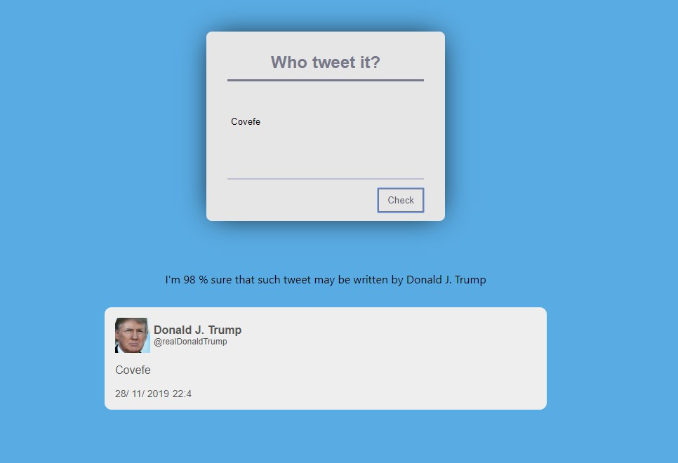

<h1 align="center">Tweets-Classifier</h1>

<div align="center">
  <sub>The little tweeter machine. Designed by
    <a href="https://github.com/Grinzzly">Grinzzly</a>
  </sub>
  <br>
  <br>
  <a href="https://github.com/airbnb/javascript">
        
  </a>
  &nbsp;
  
</div>

## About
General idea was to bring to life Neural Network that predict from random user-input phrase who is most likely to tweet it - Kim Kardashian, Donal J. Trump, or yours truly Me!

You may observe result [here](https://tweets-classifier.netlify.com/)
  


## Installation & Usage

From the root of the project directory:
```
npm i
npm run start
```
_Use at least 8.9.0 version of Node._
## Technology in use

* __ReactJS based App__
* __Brain.js__
